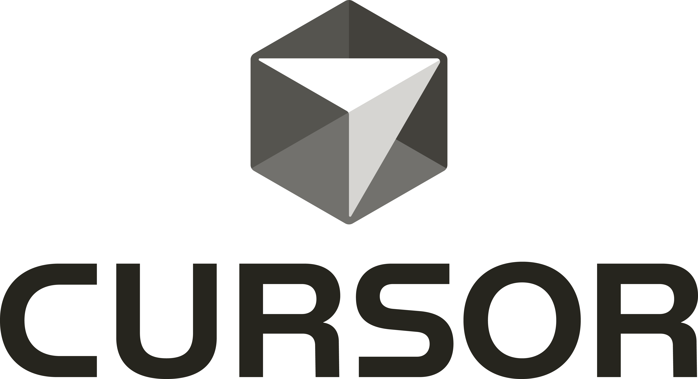

# Awesome Cursor Rules [](https://awesome.re)

<p align="center">
  <a href="https://coderabbit.ai/?utm_source=oss&utm_medium=sponsorship&utm_campaign=awesome-cursorrules" target="_blank">
    <picture>
      <source media="(prefers-color-scheme: dark)" srcset="./LOCKUP_VERTICAL_25D_DARK.png">
      
    </picture>
  </a>
</p>

Cursor Project Rules enhance Cursor AI editor behavior with project-specific guidance and reusable coding standards.

[Cursor AI](https://cursor.sh/) is an AI-powered code editor. Cursor Project Rules are Markdown-based `.mdc` files that live in `.cursor/rules/` and tell Cursor how to behave for specific projects, file types, frameworks, and workflows.

<h2>Sponsorships</h2>
<p align="center">
    <h3><a href="https://coderabbit.ai/?utm_source=oss&utm_medium=sponsorship&utm_campaign=awesome-cursorrules">coderabbit.ai - Cut Code Review Time & Bugs in Half. Instantly.</h3>
	  <a href="https://coderabbit.ai/?utm_source=oss&utm_medium=sponsorship&utm_campaign=awesome-cursorrules">
		  
	  </a>
	<h3><a href="https://getunblocked.com/unblocked-mcp/?utm_source=oss&utm_medium=sponsorship&utm_campaign=awesome-cursorrules">Unblocked MCP- Supercharge Cursor with your team’s knowledge</h3> 
	  <a href="https://getunblocked.com/unblocked-mcp/?utm_source=oss&utm_medium=sponsorship&utm_campaign=awesome-cursorrules">
		  
	  </a>
	<h3><a href="https://go.warp.dev/awesome-cursorrules">Warp - Built for coding with multiple AI agents</h3>
	  <a href="https://go.warp.dev/awesome-cursorrules">
		  
	  </a>
</p>

## Contents

- [Why Cursor Rules](#why-cursor-rules)
- [Rules](#rules)
  - [Frontend Frameworks and Libraries](#frontend-frameworks-and-libraries)
  - [Backend and Full-Stack](#backend-and-full-stack)
  - [Mobile Development](#mobile-development)
  - [Games and Graphics](#games-and-graphics)
  - [CSS and Styling](#css-and-styling)
  - [State Management](#state-management)
  - [Database and API](#database-and-api)
  - [Testing](#testing)
  - [Hosting and Deployments](#hosting-and-deployments)
  - [Build Tools and Development](#build-tools-and-development)
  - [Language-Specific](#language-specific)
  - [Security](#security)
  - [Documentation](#documentation)
- [Directories](#directories)
- [How to Use](#how-to-use)

## Why Cursor Rules

Cursor rules help developers define project-specific instructions for Cursor AI. This repository uses the modern `.mdc` Project Rules format.

Customized behavior means Cursor can respond to the specific needs of a project instead of relying only on general coding knowledge. Rules can describe local architecture, preferred libraries, common methods, domain constraints, and other context that makes generated code more relevant.

Consistency is the other big win. By defining coding standards and best practices in `.mdc` files, teams can guide Cursor toward code that matches the project's style, naming, structure, and review expectations.

Project rules also reduce repeated manual editing. Well-scoped rules give Cursor reusable project knowledge up front, so suggestions are more likely to fit the codebase on the first pass and less likely to need the same corrections again.

For teams, shared `.cursor/rules/*.mdc` files keep AI assistance aligned across contributors. Everyone can work from the same project-specific guidance, whether the rule covers framework usage, security requirements, testing conventions, or workflow details.

By adding selected `.mdc` files to `.cursor/rules/`, you can use these rules directly in your project.

## Rules

### Frontend Frameworks and Libraries

- [Angular (Novo Elements)](https://github.com/PatrickJS/awesome-cursorrules/blob/main/rules/angular-novo-elements-cursorrules-prompt-file.mdc) - Angular development with Novo Elements UI library.
- [Angular (TypeScript)](https://github.com/PatrickJS/awesome-cursorrules/blob/main/rules/angular-typescript-cursorrules-prompt-file.mdc) - Angular development with TypeScript integration.
- [Astro (TypeScript)](https://github.com/PatrickJS/awesome-cursorrules/blob/main/rules/astro-typescript-cursorrules-prompt-file.mdc) - Astro development with TypeScript integration.
- [Beefree SDK (TypeScript, JavaScript, CSS, HTML, React, Angular, Vue)](https://github.com/PatrickJS/awesome-cursorrules/blob/main/rules/beefreeSDK-nocode-content-editor-cursorrules-prompt-file.mdc) - Embedding Beefree SDK's no-code content editors (for emails, pages, and popups) into a web application.
- [Cursor AI (React, TypeScript, shadcn/ui)](https://github.com/PatrickJS/awesome-cursorrules/blob/main/rules/cursor-ai-react-typescript-shadcn-ui-cursorrules-p.mdc) - Cursor AI development with React, TypeScript, and shadcn/ui integration.
- [Next.js 15 (React 19, Vercel AI, Tailwind)](https://github.com/PatrickJS/awesome-cursorrules/blob/main/rules/nextjs15-react19-vercelai-tailwind-cursorrules-prompt-file.mdc) - Next.js development with React 19, Vercel AI, and Tailwind CSS integration.
- [Next.js 15 (Supabase, TypeScript, Security)](https://github.com/PatrickJS/awesome-cursorrules/blob/main/rules/nextjs15-supabase-cursorrules-prompt-file.mdc) - 27 architecture rules preventing AI hallucinations: insecure auth (getSession vs getUser), synchronous params, deprecated imports, missing RLS, and Stripe key exposure. Built for Cursor Agent and Claude Code.
- [Next.js 14 (Tailwind, SEO)](https://github.com/PatrickJS/awesome-cursorrules/blob/main/rules/cursorrules-cursor-ai-nextjs-14-tailwind-seo-setup.mdc) - Next.js development with Tailwind CSS and SEO optimization.
- [Next.js (React, Tailwind)](https://github.com/PatrickJS/awesome-cursorrules/blob/main/rules/nextjs-react-tailwind-cursorrules-prompt-file.mdc) - Next.js development with React and Tailwind CSS integration.
- [Next.js (React, TypeScript)](https://github.com/PatrickJS/awesome-cursorrules/blob/main/rules/nextjs-react-typescript-cursorrules-prompt-file.mdc) - Next.js development with React and TypeScript integration.
- [Next.js (SEO Development)](https://github.com/PatrickJS/awesome-cursorrules/blob/main/rules/nextjs-seo-dev-cursorrules-prompt-file.mdc) - Next.js development with SEO optimization.
- [Next.js (Supabase Todo App)](https://github.com/PatrickJS/awesome-cursorrules/blob/main/rules/nextjs-supabase-todo-app-cursorrules-prompt-file.mdc) - Next.js development with Supabase integration for a Todo app.
- [Next.js (TanStack Query v5)](https://github.com/PatrickJS/awesome-cursorrules/blob/main/rules/nextjs-tanstack-query-cursorrules-prompt-file.mdc) - Next.js App Router with TanStack Query v5, covering the HydrationBoundary pattern, Server Actions as mutations, and optimistic updates.
- [Next.js (Type LLM)](https://github.com/PatrickJS/awesome-cursorrules/blob/main/rules/next-type-llm.mdc) - Next.js development with Type LLM integration.
- [Next.js (Tailwind, TypeScript)](https://github.com/PatrickJS/awesome-cursorrules/blob/main/rules/nextjs-tailwind-typescript-apps-cursorrules-prompt.mdc) - Next.js development with Tailwind CSS and TypeScript integration.
- [Next.js (TypeScript App)](https://github.com/PatrickJS/awesome-cursorrules/blob/main/rules/nextjs-typescript-app-cursorrules-prompt-file.mdc) - Next.js development with TypeScript integration.
- [Next.js (TypeScript)](https://github.com/PatrickJS/awesome-cursorrules/blob/main/rules/nextjs-typescript-cursorrules-prompt-file.mdc) - Next.js development with TypeScript integration.
- [Next.js (TypeScript, Tailwind)](https://github.com/PatrickJS/awesome-cursorrules/blob/main/rules/nextjs-typescript-tailwind-cursorrules-prompt-file.mdc) - Next.js development with TypeScript and Tailwind CSS integration.
- [Next.js (Vercel, Supabase)](https://github.com/PatrickJS/awesome-cursorrules/blob/main/rules/nextjs-vercel-supabase-cursorrules-prompt-file.mdc) - Next.js development with Vercel and Supabase integration.
- [Next.js (Vercel, TypeScript)](https://github.com/PatrickJS/awesome-cursorrules/blob/main/rules/nextjs-vercel-typescript-cursorrules-prompt-file.mdc) - Next.js development with Vercel and TypeScript integration.
- [Next.js (App Router)](https://github.com/PatrickJS/awesome-cursorrules/blob/main/rules/nextjs-app-router-cursorrules-prompt-file.mdc) - Next.js development with App Router integration.
- [Next.js (Material UI, Tailwind CSS)](https://github.com/PatrickJS/awesome-cursorrules/blob/main/rules/nextjs-material-ui-tailwind-css-cursorrules-prompt.mdc) - Next.js development with Material UI and Tailwind CSS integration.
- [Qwik (Basic Setup with TypeScript and Vite)](https://github.com/PatrickJS/awesome-cursorrules/blob/main/rules/qwik-basic-cursorrules-prompt-file.mdc) - Qwik development with TypeScript and Vite integration.
- [Qwik (with Tailwind CSS)](https://github.com/PatrickJS/awesome-cursorrules/blob/main/rules/qwik-tailwind-cursorrules-prompt-file.mdc) - Qwik development with Tailwind CSS integration.
- [React Components Creation](https://github.com/PatrickJS/awesome-cursorrules/blob/main/rules/react-components-creation-cursorrules-prompt-file.mdc) - React component creation and development.
- [React (FormEngine AI Form Builder)](https://github.com/PatrickJS/awesome-cursorrules/blob/main/rules/react-formengine-ai-form-builder-cursorrules-prompt-file.mdc) - Generating React forms from screenshots, PDFs, HTML, or text descriptions with validated FormEngine JSON schema. Renders through RSuite, Material UI, or Mantine.
- [React (Next.js UI Development)](https://github.com/PatrickJS/awesome-cursorrules/blob/main/rules/react-nextjs-ui-development-cursorrules-prompt-fil.mdc) - React development with Next.js UI integration.
- [React Router v7](https://github.com/PatrickJS/awesome-cursorrules/blob/main/rules/react-router-v7.mdc) - Framework mode, data routers, loaders, actions, route modules, and progressive enhancement.
- [React (TypeScript, Next.js, Node.js)](https://github.com/PatrickJS/awesome-cursorrules/blob/main/rules/react-typescript-nextjs-nodejs-cursorrules-prompt-.mdc) - React development with TypeScript, Next.js, and Node.js integration.
- [React (TypeScript, Symfony)](https://github.com/PatrickJS/awesome-cursorrules/blob/main/rules/react-typescript-symfony-cursorrules-prompt-file.mdc) - React development with TypeScript and Symfony integration.
- [Semiotic (React, D3, Data Visualization)](https://github.com/PatrickJS/awesome-cursorrules/blob/main/rules/semiotic-react-dataviz-cursorrules-prompt-file.mdc) - Semiotic data visualization library with 30+ chart types, MCP server, and AI-assisted chart generation.
- [Shopify Theme (Liquid, JavaScript, CSS)](https://github.com/PatrickJS/awesome-cursorrules/blob/main/rules/shopify-theme-dev-liquid.mdc) - Shopify theme development with Liquid templates, section schemas, frontend assets, performance, and accessibility.
- [Solid.js (Basic Setup)](https://github.com/PatrickJS/awesome-cursorrules/blob/main/rules/solidjs-basic-cursorrules-prompt-file.mdc) - Solid.js development with basic setup.
- [Solid.js (TypeScript)](https://github.com/PatrickJS/awesome-cursorrules/blob/main/rules/solidjs-typescript-cursorrules-prompt-file.mdc) - Solid.js development with TypeScript integration.
- [Solid.js (Tailwind CSS)](https://github.com/PatrickJS/awesome-cursorrules/blob/main/rules/solidjs-tailwind-cursorrules-prompt-file.mdc) - Solid.js development with Tailwind CSS integration.
- [Svelte 5 vs Svelte 4](https://github.com/PatrickJS/awesome-cursorrules/blob/main/rules/svelte-5-vs-svelte-4-cursorrules-prompt-file.mdc) - Comparing Svelte 5 and Svelte 4 development.
- [SvelteKit (RESTful API, Tailwind CSS)](https://github.com/PatrickJS/awesome-cursorrules/blob/main/rules/sveltekit-restful-api-tailwind-css-cursorrules-pro.mdc) - SvelteKit development with RESTful API and Tailwind CSS integration.
- [SvelteKit (Tailwind CSS, TypeScript)](https://github.com/PatrickJS/awesome-cursorrules/blob/main/rules/sveltekit-tailwindcss-typescript-cursorrules-promp.mdc) - SvelteKit development with Tailwind CSS and TypeScript integration.
- [SvelteKit (TypeScript Guide)](https://github.com/PatrickJS/awesome-cursorrules/blob/main/rules/sveltekit-typescript-guide-cursorrules-prompt-file.mdc) - SvelteKit development with TypeScript integration.
- [TanStack Router (React)](https://github.com/PatrickJS/awesome-cursorrules/blob/main/rules/tanstack-router-react-cursorrules-prompt-file.mdc) - TanStack Router v1 with file-based routing, typed params, search validation, loaders, auth guards, and route preloading.
- [Vue 3 (Nuxt 3 Development)](https://github.com/PatrickJS/awesome-cursorrules/blob/main/rules/vue-3-nuxt-3-development-cursorrules-prompt-file.mdc) - Vue 3 development with Nuxt 3 integration.
- [Vue 3 (Nuxt 3, TypeScript)](https://github.com/PatrickJS/awesome-cursorrules/blob/main/rules/vue-3-nuxt-3-typescript-cursorrules-prompt-file.mdc) - Vue 3 development with TypeScript integration.
- [Vue 3 (Composition API)](https://github.com/PatrickJS/awesome-cursorrules/blob/main/rules/vue3-composition-api-cursorrules-prompt-file.mdc) - Vue 3 development with Composition API integration.
- [Vue/Nuxt Full AI Stack](https://github.com/PatrickJS/awesome-cursorrules/blob/main/rules/vue-claude-stack.mdc) - Complete AI coding setup for Vue 3 & Nuxt 3 with Cursor Project Rules, CLAUDE.md, Copilot instructions, and generation skills.

### Backend and Full-Stack

- [Cloudflare Workers (Hono, Angular)](https://github.com/PatrickJS/awesome-cursorrules/blob/main/rules/cloudflare-workers-hono-angular-saas-cursorrules-prompt-file.mdc) - Full-stack SaaS applications on Cloudflare Workers with Hono APIs, Angular frontends, typed RPC, D1/Neon, and production observability.
- [Convex Best Practices](https://github.com/PatrickJS/awesome-cursorrules/blob/main/rules/convex-cursorrules-prompt-file.mdc) - Convex development with best practices.
- [Deno Integration](https://github.com/PatrickJS/awesome-cursorrules/blob/main/rules/deno-integration-techniques-cursorrules-prompt-fil.mdc) - Deno development with integration techniques.
- [Drupal 11](https://github.com/PatrickJS/awesome-cursorrules/blob/main/rules/drupal-11-cursorrules-prompt-file.mdc) - Modern CMS development.
- [Elixir Engineer Guidelines](https://github.com/PatrickJS/awesome-cursorrules/blob/main/rules/elixir-engineer-guidelines-cursorrules-prompt-file.mdc) - Elixir development with engineer guidelines.
- [Elixir (Phoenix, Docker)](https://github.com/PatrickJS/awesome-cursorrules/blob/main/rules/elixir-phoenix-docker-setup-cursorrules-prompt-fil.mdc) - Elixir development with Phoenix and Docker integration.
- [ES Module (Node.js)](https://github.com/PatrickJS/awesome-cursorrules/blob/main/rules/es-module-nodejs-guidelines-cursorrules-prompt-fil.mdc) - ES Module development with Node.js guidelines.
- [Go Backend Scalability](https://github.com/PatrickJS/awesome-cursorrules/blob/main/rules/go-backend-scalability-cursorrules-prompt-file.mdc) - Go development with backend scalability.
- [Go ServeMux REST API](https://github.com/PatrickJS/awesome-cursorrules/blob/main/rules/go-servemux-rest-api-cursorrules-prompt-file.mdc) - Go development with ServeMux REST API integration.
- [Go (Basic Setup)](https://github.com/PatrickJS/awesome-cursorrules/blob/main/rules/htmx-go-basic-cursorrules-prompt-file.mdc) - Go development with basic setup.
- [Go with Fiber](https://github.com/PatrickJS/awesome-cursorrules/blob/main/rules/htmx-go-fiber-cursorrules-prompt-file.mdc) - Go development with Fiber integration.
- [Go Temporal DSL](https://github.com/PatrickJS/awesome-cursorrules/blob/main/rules/go-temporal-dsl-prompt-file.mdc) - Go development with Temporal DSL integration.
- [Google ADK](https://github.com/PatrickJS/awesome-cursorrules/blob/main/rules/google-adk.mdc) - Google Agent Development Kit agents, tools, sessions, memory, artifacts, evaluation, and deployment.
- [HOL (Hedera TypeScript SDK)](https://github.com/PatrickJS/awesome-cursorrules/blob/main/rules/hol-hedera-typescript-cursorrules-prompt-file.mdc) - Hashgraph Online development with TypeScript, building AI agents on Hedera with RegistryBrokerClient.
- [HTMX (Basic Setup)](https://github.com/PatrickJS/awesome-cursorrules/blob/main/rules/htmx-basic-cursorrules-prompt-file.mdc) - HTMX development with basic setup.
- [HTMX (Flask)](https://github.com/PatrickJS/awesome-cursorrules/blob/main/rules/htmx-flask-cursorrules-prompt-file.mdc) - HTMX development with Flask integration.
- [HTMX (Django)](https://github.com/PatrickJS/awesome-cursorrules/blob/main/rules/htmx-django-cursorrules-prompt-file.mdc) - HTMX development with Django integration.
- [Java (Spring Boot, JPA)](https://github.com/PatrickJS/awesome-cursorrules/blob/main/rules/java-springboot-jpa-cursorrules-prompt-file.mdc) - Java development with Spring Boot and JPA integration.
- [Knative (Istio, Typesense, GPU)](https://github.com/PatrickJS/awesome-cursorrules/blob/main/rules/knative-istio-typesense-gpu-cursorrules-prompt-fil.mdc) - Knative development with Istio, Typesense, and GPU integration.
- [Kotlin Ktor Development](https://github.com/PatrickJS/awesome-cursorrules/blob/main/rules/kotlin-ktor-development-cursorrules-prompt-file.mdc) - Kotlin development with Ktor integration.
- [Laravel (PHP 8.3)](https://github.com/PatrickJS/awesome-cursorrules/blob/main/rules/laravel-php-83-cursorrules-prompt-file.mdc) - Laravel development with PHP 8.3 integration.
- [Laravel (TALL Stack)](https://github.com/PatrickJS/awesome-cursorrules/blob/main/rules/laravel-tall-stack-best-practices-cursorrules-prom.mdc) - Laravel development with TALL Stack best practices.
- [Manifest](https://github.com/PatrickJS/awesome-cursorrules/blob/main/rules/manifest-yaml-cursorrules-prompt-file.mdc) - YAML-based configuration and metadata files.
- [Momen.app (Backend-as-a-Service)](https://github.com/PatrickJS/awesome-cursorrules/blob/main/rules/momen-cursurrules-prompt-file.mdc) - Building custom frontends with Momen.app as headless BaaS with GraphQL API, actionflows, AI agents, and Stripe integration.
- [Node.js (MongoDB)](https://github.com/PatrickJS/awesome-cursorrules/blob/main/rules/nodejs-mongodb-cursorrules-prompt-file-tutorial.mdc) - Node.js development with MongoDB integration.
- [Node.js (MongoDB, JWT, Express, React)](https://github.com/PatrickJS/awesome-cursorrules/blob/main/rules/nodejs-mongodb-jwt-express-react-cursorrules-promp.mdc) - Node.js development with MongoDB, JWT, Express, and React integration.
- [Rails 8 (Basic Setup)](https://github.com/PatrickJS/awesome-cursorrules/blob/main/rules/rails-cursorrules-prompt-file.mdc) - Rails development with basic setup.
- [Python (FastAPI)](https://github.com/PatrickJS/awesome-cursorrules/blob/main/rules/py-fast-api.mdc) - Python FastAPI backend development and best practices.
- [Python 3.12 (FastAPI Best Practices)](https://github.com/PatrickJS/awesome-cursorrules/blob/main/rules/python-312-fastapi-best-practices-cursorrules-prom.mdc) - Python FastAPI development with best practices.
- [Python (Django Best Practices)](https://github.com/PatrickJS/awesome-cursorrules/blob/main/rules/python-django-best-practices-cursorrules-prompt-fi.mdc) - Python Django development with best practices.
- [Python (FastAPI Best Practices)](https://github.com/PatrickJS/awesome-cursorrules/blob/main/rules/python-fastapi-best-practices-cursorrules-prompt-f.mdc) - Python FastAPI development with best practices.
- [Python (FastAPI Scalable API)](https://github.com/PatrickJS/awesome-cursorrules/blob/main/rules/python-fastapi-scalable-api-cursorrules-prompt-fil.mdc) - Python FastAPI development with scalable API integration.
- [Python (FastAPI Production Architecture)](https://github.com/PatrickJS/awesome-cursorrules/blob/main/rules/fastapi-production-architecture-cursorrules-prompt-file.mdc) - FastAPI services with router/service/repository boundaries, typed provider adapters, bulkhead isolation, idempotency, and domain exceptions.
- [Python (Flask JSON Guide)](https://github.com/PatrickJS/awesome-cursorrules/blob/main/rules/python-flask-json-guide-cursorrules-prompt-file.mdc) - Python Flask development with JSON guide.
- [Python LLM & ML Workflow](https://github.com/PatrickJS/awesome-cursorrules/blob/main/rules/python-llm-ml-workflow-cursorrules-prompt-file.mdc) - Python LLM & ML development with workflow integration.
- [Salesforce (Apex)](https://github.com/PatrickJS/awesome-cursorrules/blob/main/rules/salesforce-apex-cursorrules-prompt-file.mdc) - Salesforce development with Apex integration.
- [TanStack Start](https://github.com/PatrickJS/awesome-cursorrules/blob/main/rules/tanstack-start-cursorrules-prompt-file.mdc) - Full-stack React framework including server functions, API routes, streaming with defer(), SSR, and multi-platform deployment.
- [TypeScript (NestJS Anti-Hallucination)](https://github.com/PatrickJS/awesome-cursorrules/blob/main/rules/nestjs-anti-hallucination-cursorrules-prompt-file.mdc) - Rules that block deprecated, phantom, or incorrect NestJS imports, decorators, providers, modules, and testing patterns.
- [TypeScript (NestJS Best Practices)](https://github.com/PatrickJS/awesome-cursorrules/blob/main/rules/typescript-nestjs-best-practices-cursorrules-promp.mdc) - TypeScript development with NestJS best practices.
- [TYPO3 CMS Extension](https://github.com/PatrickJS/awesome-cursorrules/blob/main/rules/typo3cms-extension-cursorrules-prompt-file.mdc) - TYPO3 CMS development with extension integration.
- [WordPress (PHP, Guzzle, Gutenberg)](https://github.com/PatrickJS/awesome-cursorrules/blob/main/rules/wordpress-php-guzzle-gutenberg-cursorrules-prompt-.mdc) - WordPress development with PHP, Guzzle, and Gutenberg integration.
- [WordPress (macOS)](https://github.com/PatrickJS/awesome-cursorrules/blob/main/rules/cursorrules-cursor-ai-wordpress-draft-macos-prompt.mdc) - WordPress development on macOS.
- [WordPress Full AI Stack](https://github.com/PatrickJS/awesome-cursorrules/blob/main/rules/wordpress-claude-stack.mdc) - Complete AI coding setup for WordPress — themes, plugins, Gutenberg, WooCommerce, ACF, REST API with Cursor Project Rules, CLAUDE.md, Copilot instructions, and 5 generation skills.

### Mobile Development

- [Android Native (Jetpack Compose)](https://github.com/PatrickJS/awesome-cursorrules/blob/main/rules/android-jetpack-compose-cursorrules-prompt-file.mdc) - Android development with Jetpack Compose integration.
- [Cursor Rules Pack v2](https://github.com/PatrickJS/awesome-cursorrules/blob/main/rules/cursor-rules-pack-v2-cursorrules-prompt-file.mdc) - 7 sample production-tested rules (dependency discipline, error handling, state management, webhook security, and more). See the pack README for full-pack details.
- [Flutter Expert](https://github.com/PatrickJS/awesome-cursorrules/blob/main/rules/flutter-app-expert-cursorrules-prompt-file.mdc) - Flutter development with expert integration.
- [HarmonyOS ArkTS](https://github.com/PatrickJS/awesome-cursorrules/blob/main/rules/harmony-arkts.mdc) - Components, state, resources, lifecycle, layout, and accessibility.
- [NativeScript](https://github.com/PatrickJS/awesome-cursorrules/blob/main/rules/nativescript-cursorrules-prompt-file.mdc) - Cross-platform mobile app development.
- [React Native Expo](https://github.com/PatrickJS/awesome-cursorrules/blob/main/rules/react-native-expo-cursorrules-prompt-file.mdc) - Expo-based mobile app development.
- [SwiftUI Guidelines](https://github.com/PatrickJS/awesome-cursorrules/blob/main/rules/swiftui-guidelines-cursorrules-prompt-file.mdc) - SwiftUI development guidelines.
- [TypeScript (Expo, Jest, Detox)](https://github.com/PatrickJS/awesome-cursorrules/blob/main/rules/typescript-expo-jest-detox-cursorrules-prompt-file.mdc) - TypeScript development with Expo, Jest, and Detox integration.
- [UIKit Guidelines](https://github.com/PatrickJS/awesome-cursorrules/blob/main/rules/uikit-guidelines-cursorrules-prompt-file.mdc) - UIKit development guidelines.

### Games and Graphics

- [ASCII Simulation Game](https://github.com/PatrickJS/awesome-cursorrules/blob/main/rules/ascii-simulation-game-cursorrules-prompt-file.mdc) - Text-based simulation game development.
- [Blender Python Add-ons](https://github.com/PatrickJS/awesome-cursorrules/blob/main/rules/blender-python-addon.mdc) - Operators, panels, properties, registration, and API-safe scripting.
- [DragonRuby Best Practices](https://github.com/PatrickJS/awesome-cursorrules/blob/main/rules/dragonruby-best-practices-cursorrules-prompt-file.mdc) - DragonRuby development with best practices integration.
- [GameMaker GML](https://github.com/PatrickJS/awesome-cursorrules/blob/main/rules/gamemaker-gml.mdc) - GameMaker Language projects, objects, events, rooms, data structures, and performance-minded gameplay code.
- [Graphical Apps Development](https://github.com/PatrickJS/awesome-cursorrules/blob/main/rules/graphical-apps-development-cursorrules-prompt-file.mdc) - Interactive visual application development.
- [Unity (C#)](https://github.com/PatrickJS/awesome-cursorrules/blob/main/rules/unity-cursor-ai-c-cursorrules-prompt-file.mdc) - Unity development with C# integration.

### CSS and Styling

- [Landing Page Image Quality](https://github.com/PatrickJS/awesome-cursorrules/blob/main/rules/landing-page-image-quality-cursorrules-prompt-file.mdc) - Avoiding placeholder or broken image URLs, using stable visual assets, and checking alt text, dimensions, licensing, and responsive behavior.
- [Tailwind CSS (Next.js Guide)](https://github.com/PatrickJS/awesome-cursorrules/blob/main/rules/tailwind-css-nextjs-guide-cursorrules-prompt-file.mdc) - Tailwind CSS development with Next.js integration.
- [Tailwind (React, Firebase)](https://github.com/PatrickJS/awesome-cursorrules/blob/main/rules/tailwind-react-firebase-cursorrules-prompt-file.mdc) - Tailwind development with React and Firebase integration.
- [Tailwind (shadcn/ui Integration)](https://github.com/PatrickJS/awesome-cursorrules/blob/main/rules/tailwind-shadcn-ui-integration-cursorrules-prompt-.mdc) - Tailwind development with shadcn/ui integration.
- [HTML (Tailwind CSS, JavaScript)](https://github.com/PatrickJS/awesome-cursorrules/blob/main/rules/html-tailwind-css-javascript-cursorrules-prompt-fi.mdc) - HTML development with Tailwind CSS and JavaScript integration.
- [JavaScript (Astro, Tailwind CSS)](https://github.com/PatrickJS/awesome-cursorrules/blob/main/rules/javascript-astro-tailwind-css-cursorrules-prompt-f.mdc) - JavaScript development with Astro and Tailwind CSS integration.
- [React (Styled Components)](https://github.com/PatrickJS/awesome-cursorrules/blob/main/rules/react-styled-components-cursorrules-prompt-file.mdc) - React development with Styled Components integration.
- [React (Chakra UI)](https://github.com/PatrickJS/awesome-cursorrules/blob/main/rules/react-chakra-ui-cursorrules-prompt-file.mdc) - React development with Chakra UI integration.
- [RTL / Right-to-Left (i18n, Tailwind, React Native)](https://github.com/PatrickJS/awesome-cursorrules/blob/main/rules/rtl-right-to-left-i18n-cursorrules-prompt-file.mdc) - RTL development with logical CSS properties, Tailwind logical classes, bidirectional text, and automated auditing via rtlify-ai.
- [Toss-Style Design System](https://github.com/PatrickJS/awesome-cursorrules/blob/main/rules/toss-style-design-system.mdc) - Disciplined product UI with restrained color, grayscale hierarchy, typography, cards, metrics, dark mode, and accessibility.

### State Management

- [React (Redux, TypeScript)](https://github.com/PatrickJS/awesome-cursorrules/blob/main/rules/react-redux-typescript-cursorrules-prompt-file.mdc) - React development with Redux and TypeScript integration.
- [React (MobX)](https://github.com/PatrickJS/awesome-cursorrules/blob/main/rules/react-mobx-cursorrules-prompt-file.mdc) - React development with MobX integration.
- [React (React Query)](https://github.com/PatrickJS/awesome-cursorrules/blob/main/rules/react-query-cursorrules-prompt-file.mdc) - React development with React Query integration.
- [React (TanStack Router + Query)](https://github.com/PatrickJS/awesome-cursorrules/blob/main/rules/react-tanstack-router-query-cursorrules-prompt-file.mdc) - React SPAs combining TanStack Router v1 and TanStack Query v5 for zero-loading-spinner routing and type-safe server state.
- [React (Zustand)](https://github.com/PatrickJS/awesome-cursorrules/blob/main/rules/react-zustand-cursorrules-prompt-file.mdc) - React state management with Zustand stores, selectors, middleware, persistence, and testing.
- [TanStack Query v5](https://github.com/PatrickJS/awesome-cursorrules/blob/main/rules/tanstack-query-v5-cursorrules-prompt-file.mdc) - Query options, query key factories, mutations, optimistic updates, infinite queries, Suspense, and prefetching.
- [Vue (Pinia)](https://github.com/PatrickJS/awesome-cursorrules/blob/main/rules/vue-pinia-cursorrules-prompt-file.mdc) - Vue 3 state management with Pinia stores, Composition API usage, SSR, persistence, and testing.

### Database and API

- [GraphQL (Apollo Client)](https://github.com/PatrickJS/awesome-cursorrules/blob/main/rules/react-graphql-apollo-client-cursorrules-prompt-file.mdc) - GraphQL development with Apollo Client integration.
- [Snowflake Cortex AI](https://github.com/PatrickJS/awesome-cursorrules/blob/main/rules/snowflake-cortex-ai-cursorrules-prompt-file.mdc) - AI_COMPLETE, AI_CLASSIFY, AI_EXTRACT, Cortex Search, and RAG applications.
- [Snowflake Data Engineering](https://github.com/PatrickJS/awesome-cursorrules/blob/main/rules/snowflake-data-engineering-cursorrules-prompt-file.mdc) - Snowflake SQL, data pipelines (Dynamic Tables, Streams, Tasks, Snowpipe), semi-structured data, Snowflake PostgreSQL, and cost optimization.
- [Snowflake Snowpark Python & dbt](https://github.com/PatrickJS/awesome-cursorrules/blob/main/rules/snowflake-snowpark-dbt-cursorrules-prompt-file.mdc) - Snowpark Python (DataFrames, UDFs, stored procedures) and dbt with the Snowflake adapter.
- [TypeScript (Axios)](https://github.com/PatrickJS/awesome-cursorrules/blob/main/rules/typescript-axios-cursorrules-prompt-file.mdc) - TypeScript development with Axios integration.

### Testing

- [Cypress API Testing](https://github.com/PatrickJS/awesome-cursorrules/blob/main/rules/cypress-api-testing-cursorrules-prompt-file.mdc) - Cypress development with API testing.
- [Cypress Accessibility Testing](https://github.com/PatrickJS/awesome-cursorrules/blob/main/rules/cypress-accessibility-testing-cursorrules-prompt-file.mdc) - Cypress development with accessibility testing.
- [Cypress Defect Tracking](https://github.com/PatrickJS/awesome-cursorrules/blob/main/rules/cypress-defect-tracking-cursorrules-prompt-file.mdc) - Cypress development with defect tracking.
- [Cypress E2E Testing](https://github.com/PatrickJS/awesome-cursorrules/blob/main/rules/cypress-e2e-testing-cursorrules-prompt-file.mdc) - Cypress development with E2E testing.
- [Cypress Integration Testing](https://github.com/PatrickJS/awesome-cursorrules/blob/main/rules/cypress-integration-testing-cursorrules-prompt-file.mdc) - Cypress development with integration testing.
- [Jest Unit Testing](https://github.com/PatrickJS/awesome-cursorrules/blob/main/rules/jest-unit-testing-cursorrules-prompt-file.mdc) - Jest development with unit testing.
- [Playwright API Testing](https://github.com/PatrickJS/awesome-cursorrules/blob/main/rules/playwright-api-testing-cursorrules-prompt-file.mdc) - Playwright development with API testing.
- [Playwright Accessibility Testing](https://github.com/PatrickJS/awesome-cursorrules/blob/main/rules/playwright-accessibility-testing-cursorrules-prompt-file.mdc) - Playwright development with accessibility testing.
- [Playwright Defect Tracking](https://github.com/PatrickJS/awesome-cursorrules/blob/main/rules/playwright-defect-tracking-cursorrules-prompt-file.mdc) - Playwright development with defect tracking.
- [Playwright E2E Testing](https://github.com/PatrickJS/awesome-cursorrules/blob/main/rules/playwright-e2e-testing-cursorrules-prompt-file.mdc) - Playwright development with E2E testing.
- [Playwright Integration Testing](https://github.com/PatrickJS/awesome-cursorrules/blob/main/rules/playwright-integration-testing-cursorrules-prompt-file.mdc) - Playwright development with integration testing.
- [PR Review (security / performance / tests / architecture)](https://github.com/PatrickJS/awesome-cursorrules/blob/main/rules/pr-review-cursorrules-prompt-file.mdc) - Focused PR reviews with severity ranking, file and line citations, and separate review angles for security, performance, tests, and architecture.
- [PR Template](https://github.com/PatrickJS/awesome-cursorrules/blob/main/rules/pr-template-cursorrules-prompt-file.mdc) - PR development with template integration.
- [QA Bug Report](https://github.com/PatrickJS/awesome-cursorrules/blob/main/rules/qa-bug-report-cursorrules-prompt-file.mdc) - QA development with bug report integration.
- [TestRail Test Case](https://github.com/PatrickJS/awesome-cursorrules/blob/main/rules/testrail-test-case-cursorrules-prompt-file.mdc) - TestRail development with test case integration.
- [Vitest Unit Testing](https://github.com/PatrickJS/awesome-cursorrules/blob/main/rules/vitest-unit-testing-cursorrules-prompt-file.mdc) - Vitest development with unit testing.
- [Xray Test Case](https://github.com/PatrickJS/awesome-cursorrules/blob/main/rules/xray-test-case-cursorrules-prompt-file.mdc) - Xray development with test case integration.

### Hosting and Deployments

- [Cloudflare Email to Telegram](https://github.com/PatrickJS/awesome-cursorrules/blob/main/rules/cloudflare-email-telegram-cursorrules-prompt-file.mdc) - Setting up email-to-Telegram forwarding via Cloudflare Email Routing and Workers using the mail2tg CLI.
- [Netlify](https://github.com/PatrickJS/awesome-cursorrules/blob/main/rules/netlify-official-cursorrules-prompt-file.mdc) - Official deployment platform integration.
- [Vercel](https://github.com/PatrickJS/awesome-cursorrules/blob/main/rules/vercel-deployment-cursorrules-prompt-file.mdc) - Deployment with serverless functions, Edge Runtime, middleware, caching, CI/CD, and production-ready configuration.

### Build Tools and Development

- [AI Agent Specialist](https://github.com/PatrickJS/awesome-cursorrules/blob/main/rules/ai-agent-specialist.mdc) - TypeScript, React, Node.js, clean architecture, testing, and WHY-oriented engineering guidance.
- [Alpha Skills](https://github.com/PatrickJS/awesome-cursorrules/blob/main/rules/alpha-skills-quant-factor-research.mdc) - Quantitative factor research skills for Cursor. Evaluate factors, run backtests, mine new alpha through natural language.
- [Anti-Over-Engineering](https://github.com/PatrickJS/awesome-cursorrules/blob/main/rules/anti-overengineering.mdc) - Keeping changes scoped, simple, and directly tied to the user's request.
- [Anti-Sycophancy Code Discipline](https://github.com/PatrickJS/awesome-cursorrules/blob/main/rules/anti-sycophancy-code-discipline-cursorrules-prompt-file.mdc) - 17 directives blocking the most common LLM coding honesty failures: hallucinated APIs, invented signatures, false-confidence validation, manufactured-urgency capitulation, authority-driven softening, and self-referential comments. Drop the `.mdc` in `.cursor/rules/`.
- [Chrome Extension (JavaScript/TypeScript)](https://github.com/PatrickJS/awesome-cursorrules/blob/main/rules/chrome-extension-dev-js-typescript-cursorrules-pro.mdc) - Chrome extension development with JavaScript and TypeScript integration.
- [Code Guidelines](https://github.com/PatrickJS/awesome-cursorrules/blob/main/rules/code-guidelines-cursorrules-prompt-file.mdc) - Code development with guidelines integration.
- [Code Pair Interviews](https://github.com/PatrickJS/awesome-cursorrules/blob/main/rules/code-pair-interviews.mdc) - Interview practice and collaborative coding sessions.
- [Code Style Consistency](https://github.com/PatrickJS/awesome-cursorrules/blob/main/rules/code-style-consistency-cursorrules-prompt-file.mdc) - Code development with style consistency integration.
- [Embedded MCU / STM32 / HAL](https://github.com/PatrickJS/awesome-cursorrules/blob/main/rules/embedded-stm32-hal.mdc) - Embedded C/C++ development with STM32 HAL, interrupts, DMA, memory constraints, and hardware-focused testing.
- [Engineering Ticket Template](https://github.com/PatrickJS/awesome-cursorrules/blob/main/rules/engineering-ticket-template-cursorrules-prompt-file.mdc) - Engineering development with ticket template integration.
- [GitHub Code Quality](https://github.com/PatrickJS/awesome-cursorrules/blob/main/rules/github-code-quality-cursorrules-prompt-file.mdc) - GitHub development with code quality integration.
- [GitHub Instructions](https://github.com/PatrickJS/awesome-cursorrules/blob/main/rules/github-cursorrules-prompt-file-instructions.mdc) - GitHub development with instructions integration.
- [Git Commit Messages](https://github.com/PatrickJS/awesome-cursorrules/blob/main/rules/git-conventional-commit-messages.mdc) - Git development with conventional commit messages integration.
- [Kubernetes (MkDocs Documentation)](https://github.com/PatrickJS/awesome-cursorrules/blob/main/rules/kubernetes-mkdocs-documentation-cursorrules-prompt.mdc) - Kubernetes development with MkDocs documentation integration.
- [Linux (NVIDIA CUDA, Python)](https://github.com/PatrickJS/awesome-cursorrules/blob/main/rules/linux-nvidia-cuda-python-cursorrules-prompt-file.mdc) - Linux development with NVIDIA CUDA and Python integration.
- [Optimize (DRY, SOLID Principles)](https://github.com/PatrickJS/awesome-cursorrules/blob/main/rules/optimize-dry-solid-principles-cursorrules-prompt-f.mdc) - Optimization development with DRY and SOLID principles integration.
- [Project Epic Template](https://github.com/PatrickJS/awesome-cursorrules/blob/main/rules/project-epic-template-cursorrules-prompt-file.mdc) - Project development with epic template integration.
- [Python Containerization](https://github.com/PatrickJS/awesome-cursorrules/blob/main/rules/python-containerization-cursorrules-prompt-file.mdc) - Python development with containerization integration.
- [Python (GitHub Setup)](https://github.com/PatrickJS/awesome-cursorrules/blob/main/rules/python-github-setup-cursorrules-prompt-file.mdc) - Python development with GitHub setup integration.
- [ROS / ROS2](https://github.com/PatrickJS/awesome-cursorrules/blob/main/rules/ros-ros2.mdc) - ROS and ROS2 packages, nodes, launch files, messages, services, actions, simulation, and testing.
- [Tauri (Svelte, TypeScript Guide)](https://github.com/PatrickJS/awesome-cursorrules/blob/main/rules/tauri-svelte-typescript-guide-cursorrules-prompt-f.mdc) - Tauri development with Svelte and TypeScript guide integration.
- [TypeScript Code Convention](https://github.com/PatrickJS/awesome-cursorrules/blob/main/rules/typescript-code-convention-cursorrules-prompt-file.mdc) - TypeScript development with code convention integration.
- [VSCode Extension (Electron/TypeScript)](https://github.com/PatrickJS/awesome-cursorrules/blob/main/rules/vscode-extension-dev-typescript-cursorrules-prompt-file.mdc) - VSCode extension development with Electron and TypeScript integration.
- [Web App Optimization](https://github.com/PatrickJS/awesome-cursorrules/blob/main/rules/web-app-optimization-cursorrules-prompt-file.mdc) - Web app development with optimization integration.
- [Ankra CLI (Kubernetes Cluster Management)](https://github.com/PatrickJS/awesome-cursorrules/blob/main/rules/ankra-cli.mdc) - Ankra CLI development with Kubernetes cluster management integration.
    
### Language-Specific

- [AutoML and Hyperparameter Optimization](https://github.com/PatrickJS/awesome-cursorrules/blob/main/rules/automl-hyperparameter-optimization.mdc) - Python ML model search, validation design, search spaces, experiment tracking, and time-series AutoML.
- [Fortran](https://github.com/PatrickJS/awesome-cursorrules/blob/main/rules/fortran.mdc) - Modern Fortran scientific computing, modules, explicit interfaces, kind parameters, memory safety, and testing.
- [JavaScript/TypeScript Code Quality](https://github.com/PatrickJS/awesome-cursorrules/blob/main/rules/javascript-typescript-code-quality-cursorrules-pro.mdc) - JavaScript and TypeScript development with code quality integration.
- [JavaScript (Chrome APIs)](https://github.com/PatrickJS/awesome-cursorrules/blob/main/rules/javascript-chrome-apis-cursorrules-prompt-file.mdc) - JavaScript development with Chrome APIs integration.
- [Optimize (Rell Blockchain Code)](https://github.com/PatrickJS/awesome-cursorrules/blob/main/rules/optimize-rell-blockchain-code-cursorrules-prompt-f.mdc) - Optimization development with Rell Blockchain code integration.
- [Pandas (scikit-learn Guide)](https://github.com/PatrickJS/awesome-cursorrules/blob/main/rules/pandas-scikit-learn-guide-cursorrules-prompt-file.mdc) - Pandas development with scikit-learn guide integration.
- [Plasticode (Telegram API)](https://github.com/PatrickJS/awesome-cursorrules/blob/main/rules/plasticode-telegram-api-cursorrules-prompt-file.mdc) - Plasticode development with Telegram API integration.
- [PyQt6 (EEG Processing)](https://github.com/PatrickJS/awesome-cursorrules/blob/main/rules/pyqt6-eeg-processing-cursorrules-prompt-file.mdc) - PyQt6 development with EEG processing integration.
- [Python/TypeScript Guide](https://github.com/PatrickJS/awesome-cursorrules/blob/main/rules/python--typescript-guide-cursorrules-prompt-file.mdc) - Python development with TypeScript guide integration.
- [Python Best Practices](https://github.com/PatrickJS/awesome-cursorrules/blob/main/rules/python-cursorrules-prompt-file-best-practices.mdc) - Python development with best practices integration.
- [Python Developer](https://github.com/PatrickJS/awesome-cursorrules/blob/main/rules/python-developer-cursorrules-prompt-file.mdc) - Python development with developer integration.
- [Python Projects Guide](https://github.com/PatrickJS/awesome-cursorrules/blob/main/rules/python-projects-guide-cursorrules-prompt-file.mdc) - Python development with projects guide integration.
- [PySpark ETL Best Practices](https://github.com/PatrickJS/awesome-cursorrules/blob/main/rules/pyspark-etl-best-practices-cursorrules-prompt-file.mdc) - PySpark ETL development with code style, joins, window functions, map operations, and Iceberg patterns.
- [PyTorch (scikit-learn)](https://github.com/PatrickJS/awesome-cursorrules/blob/main/rules/pytorch-scikit-learn-cursorrules-prompt-file.mdc) - PyTorch development with scikit-learn integration.
- [R Best Practices](https://github.com/PatrickJS/awesome-cursorrules/blob/main/rules/r-cursorrules-prompt-file-best-practices.mdc) - R development with best practices integration.
- [Rust](https://github.com/PatrickJS/awesome-cursorrules/blob/main/rules/rust-general.mdc) - Safe, idiomatic Rust application and library development.
- [Solidity (Foundry)](https://github.com/PatrickJS/awesome-cursorrules/blob/main/rules/solidity-foundry-cursorrules-prompt-file.mdc) - Solidity development with Foundry integration.
- [Solidity (Hardhat)](https://github.com/PatrickJS/awesome-cursorrules/blob/main/rules/solidity-hardhat-cursorrules-prompt-file.mdc) - Solidity development with Hardhat integration.
- [Solidity (React Blockchain Apps)](https://github.com/PatrickJS/awesome-cursorrules/blob/main/rules/solidity-react-blockchain-apps-cursorrules-prompt-.mdc) - Solidity development with React Blockchain apps integration.
- [Solana Wallet-Aware Coding](https://github.com/PatrickJS/awesome-cursorrules/blob/main/rules/solana-wallet-aware.mdc) - Solana wallet safety, isolated signers, program allowlists, MEV-aware transaction handling, and operational guardrails.
- [TypeScript (LLM Tech Stack)](https://github.com/PatrickJS/awesome-cursorrules/blob/main/rules/typescript-llm-tech-stack-cursorrules-prompt-file.mdc) - TypeScript development with LLM tech stack integration.
- [TypeScript (Node.js, Next.js, AI)](https://github.com/PatrickJS/awesome-cursorrules/blob/main/rules/typescript-nodejs-nextjs-ai-cursorrules-prompt-fil.mdc) - TypeScript development with Node.js, Next.js, and AI integration.
- [TypeScript (Node.js, Next.js, React, UI, CSS)](https://github.com/PatrickJS/awesome-cursorrules/blob/main/rules/typescript-nodejs-nextjs-react-ui-css-cursorrules-.mdc) - TypeScript development with Node.js, Next.js, React, UI, and CSS integration.
- [TypeScript (Node.js, React, Vite)](https://github.com/PatrickJS/awesome-cursorrules/blob/main/rules/typescript-nodejs-react-vite-cursorrules-prompt-fi.mdc) - TypeScript development with Node.js, React, and Vite integration.
- [TypeScript (React, Next.js, Cloudflare)](https://github.com/PatrickJS/awesome-cursorrules/blob/main/rules/typescript-react-nextjs-cloudflare-cursorrules-pro.mdc) - TypeScript development with React, Next.js, and Cloudflare integration.
- [TypeScript (React, NextUI, Supabase)](https://github.com/PatrickJS/awesome-cursorrules/blob/main/rules/typescript-react-nextui-supabase-cursorrules-promp.mdc) - TypeScript development with React, NextUI, and Supabase integration.
- [TypeScript (shadcn/ui, Next.js)](https://github.com/PatrickJS/awesome-cursorrules/blob/main/rules/typescript-shadcn-ui-nextjs-cursorrules-prompt-fil.mdc) - TypeScript development with shadcn/ui and Next.js integration.
- [TypeScript (Vite, Tailwind)](https://github.com/PatrickJS/awesome-cursorrules/blob/main/rules/typescript-vite-tailwind-cursorrules-prompt-file.mdc) - TypeScript development with Vite and Tailwind integration.
- [TypeScript (Vue.js)](https://github.com/PatrickJS/awesome-cursorrules/blob/main/rules/typescript-vuejs-cursorrules-prompt-file.mdc) - TypeScript development with Vue.js integration.
- [TypeScript (Zod, Tailwind, Next.js)](https://github.com/PatrickJS/awesome-cursorrules/blob/main/rules/typescript-zod-tailwind-nextjs-cursorrules-prompt-.mdc) - TypeScript development with Zod, Tailwind, and Next.js integration.
- [WebAssembly (Z80 Cellular Automata)](https://github.com/PatrickJS/awesome-cursorrules/blob/main/rules/webassembly-z80-cellular-automata-cursorrules-prom.mdc) - WebAssembly development with Z80 Cellular Automata integration.
- [TypeScript (Next.js)](https://github.com/PatrickJS/awesome-cursorrules/blob/main/rules/typescript-nextjs-cursorrules-prompt-file.mdc) - TypeScript development with Next.js integration.
- [TypeScript (Next.js, React)](https://github.com/PatrickJS/awesome-cursorrules/blob/main/rules/typescript-nextjs-react-cursorrules-prompt-file.mdc) - TypeScript development with Next.js and React integration.
- [TypeScript (Next.js, React, Tailwind, Supabase)](https://github.com/PatrickJS/awesome-cursorrules/blob/main/rules/typescript-nextjs-react-tailwind-supabase-cursorru.mdc) - TypeScript development with Next.js, React, Tailwind, and Supabase integration.
- [TypeScript (Next.js, Supabase)](https://github.com/PatrickJS/awesome-cursorrules/blob/main/rules/typescript-nextjs-supabase-cursorrules-prompt-file.mdc) - TypeScript development with Next.js and Supabase integration.
- [TypeScript (Node.js, Next.js App)](https://github.com/PatrickJS/awesome-cursorrules/blob/main/rules/typescript-nodejs-nextjs-app-cursorrules-prompt-fi.mdc) - TypeScript development with Node.js and Next.js app integration.
- [TypeScript (React)](https://github.com/PatrickJS/awesome-cursorrules/blob/main/rules/typescript-react-cursorrules-prompt-file.mdc) - TypeScript development with React integration.
- [TypeScript (Clasp App Script)](https://github.com/PatrickJS/awesome-cursorrules/blob/main/rules/typescript-clasp-cursorrules-prompt-file.mdc) - TypeScript development with Clasp app script integration.
- [C++ Programming Guidelines](https://github.com/PatrickJS/awesome-cursorrules/blob/main/rules/cpp-programming-guidelines-cursorrules-prompt-file.mdc) - C++ development with programming guidelines integration.
- [TensorFlow and Deep Learning](https://github.com/PatrickJS/awesome-cursorrules/blob/main/rules/tensorflow-deep-learning.mdc) - TensorFlow model development, training, evaluation, export, and deployment.

### Security

- [DevSecOps, SSDLC, and AppSec](https://github.com/PatrickJS/awesome-cursorrules/blob/main/rules/security-devsecops-ssdls-appsec.mdc) - Secure coding, secret handling, dependency hygiene, authentication, authorization, security testing, and compliance documentation.

### Documentation

- [Gherkin Style Testing](https://github.com/PatrickJS/awesome-cursorrules/blob/main/rules/gherkin-style-testing-cursorrules-prompt-file.mdc) - Behavior-driven scenarios and acceptance criteria.
- [How-To Documentation](https://github.com/PatrickJS/awesome-cursorrules/blob/main/rules/how-to-documentation-cursorrules-prompt-file.mdc) - Task-oriented guides and procedural documentation.
- [README Best Practices](https://github.com/PatrickJS/awesome-cursorrules/blob/main/rules/readme-best-practices-cursorrules-prompt-file.mdc) - README documentation with best practices integration.

## Directories

- [CursorList](https://cursorlist.com)
- [CursorDirectory](https://cursor.directory/)

## How to Use

### Project Rules

1. Install Cursor AI if you haven't already.
2. Browse the rules above to find an `.mdc` rule that suits your needs.
3. Create a `.cursor/rules/` directory in your project if it does not already exist.
4. Copy the chosen `.mdc` file into `.cursor/rules/`.
5. Customize the rule as needed for your specific project requirements.

## Contributing

Contributions are welcome! If you have a great Cursor rule to share:

1. Fork this repository.
2. Choose a descriptive slug for the rule, such as `react-typescript` or `python-fastapi`.
3. Add the canonical `.mdc` rule under `rules/`.
4. New `rules/*.mdc` files must start with frontmatter like this:

   ```yaml
   ---
   description: One-line summary of what this rule helps Cursor do
   globs: **/*.ts, **/*.tsx
   alwaysApply: false
   ---
   ```

   The `description` field explains the rule's purpose to Cursor and contributors. The `globs` field lists the file patterns where the rule should auto-attach. Use `alwaysApply: false` to keep the rule scoped to matching or requested context, and use `alwaysApply: true` only for universal guidance that should apply to every request.

5. Update the main README.md file, adding your contribution to the appropriate category.
6. Ensure your contribution follows the repository formatting and naming guidelines.
7. Submit a pull request.

Please ensure your contribution is original or properly credited if based on existing work. Keep descriptions neutral, practical, and focused on reusable Cursor rule value.

## Footnotes

### Sponsorships

- [coderabbit.ai](https://coderabbit.ai/?utm_source=oss&utm_medium=sponsorship&utm_campaign=awesome-cursorrules) - Cut code review time and bugs in half.
- [Unblocked MCP](https://getunblocked.com/unblocked-mcp/?utm_source=oss&utm_medium=sponsorship&utm_campaign=awesome-cursorrules) - Team knowledge for Cursor workflows.
- [Warp](https://go.warp.dev/awesome-cursorrules) - Terminal workflows for coding with multiple AI agents.
